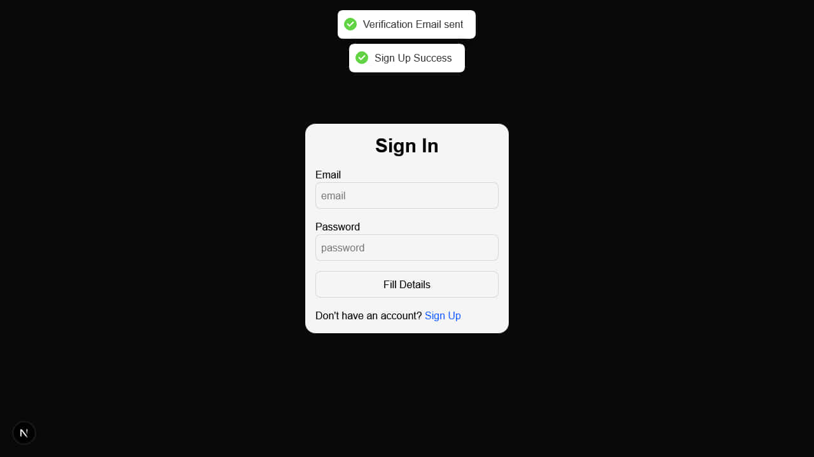

# Step Into Nextjs using this repo

- make an account and revieve true feed back
- send anonymous message to the user


```bash
# clone
git clone https://github.com/mintdexdev/learn_nextjs.git

# change directory
cd trueself

# install dependencies
npm i

# run project
npm run dev

# build project
npm run build

# preview build project
npm run start
```

## Libraries and tools used

```
Next
React
Tailwind CSS
Shadcn ui
Mongoose
Zod
bcrypt
Resend 
React-Email 
bcryptjs
Next-Auth (Authjs)
Ai (by vercel)
Axios
React Hook Form
```

## Preview
- landing

- dashboard

- send message

- sign up

- login

- popups

- email verifcation


